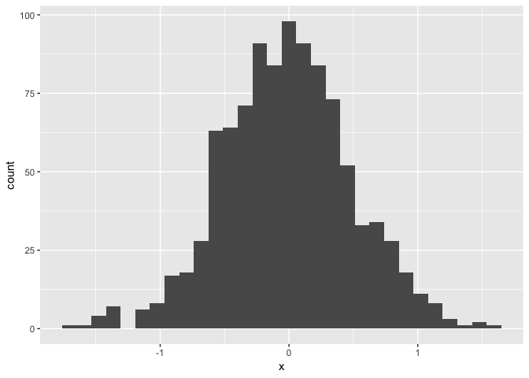
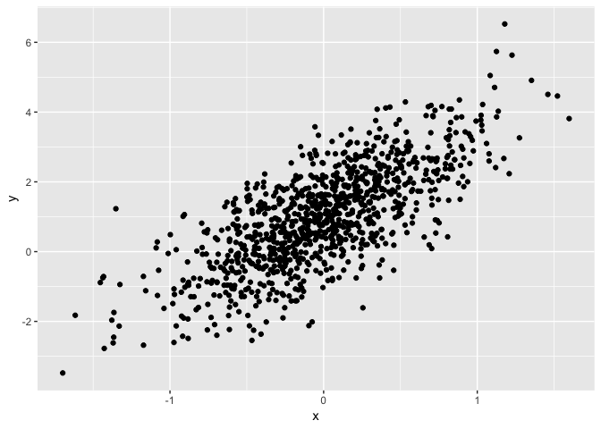

Homework 1: Amelia Grant-Alfieri, ag3911
================

# embed R code:

``` r
summary(cars)
```

    ##      speed           dist       
    ##  Min.   : 4.0   Min.   :  2.00  
    ##  1st Qu.:12.0   1st Qu.: 26.00  
    ##  Median :15.0   Median : 36.00  
    ##  Mean   :15.4   Mean   : 42.98  
    ##  3rd Qu.:19.0   3rd Qu.: 56.00  
    ##  Max.   :25.0   Max.   :120.00

# include plots

You can also embed plots, for example:

<!-- -->

Note that the `echo = FALSE` parameter was added to the code chunk to
prevent printing of the R code that generated the plot.

The purpose of this file is to present a couple of basic plots using
`ggplot`.

First we create a dataframe containing variables for our plots.

# Problem 1

First, we create a dataframe containing four elements: - A random sample
of size 10 from a uniform \[0,5\] distribution - A logical vector
indicating whether elements of the sample are greater than 2 - A
(length-10) character vector - A (length-10) factor vector.

``` r
set.seed(1234)

plot_df = tibble(
  x = rnorm(1000, sd = .5),
  y = 1 + 2 * x + rnorm(1000)
)
```

Second, we caluclate the mean of each variable. Then we analyze what
works and what doesn’t work and why.

Third, we apply the as.numeric function to the logical, character, and
factor variables. Then we describe what happens.

Fourth, we convert the character variable to factor to numeric and
convert the factor variable from factor to character to numeric. Then we
describe what happens.

# Problem 2

First, we create a data frame containing five elements: - x: a random
sample of size 1000 from a standard Normal distribution - y: a random
sample of size 1000 from a standard Normal distribution - A logical
vector indicating whether the x + y \> 0 - A numeric vector created by
coercing the above logical vector - A factor vector created by coercing
the above logical vector-

Second, we describe the vector using inline R code, including: i) the
size of the dataset, ii) the mean and median of x, and iii) the
proportion of cases for which the logical vector is TRUE.

Third, we make a scatterplot of y vs x and color points using the
logical variable (adding color = … inside of aes in your ggplot code
should help).

Fourth, we make a scatterplot that color points using the numeric
variable. Then we comment on the color scale.

Fifth, we make a scatterplot that color points using the factor
variable. Then we comment on the color scale.

Last, we export our first logical variable scatterplot to the project
directory using ggsave.

First we show a histogram of the `x`
    variable.

``` r
ggplot(plot_df, aes(x = x)) + geom_histogram()
```

    ## `stat_bin()` using `bins = 30`. Pick better value with `binwidth`.

<!-- -->

Next we show a scatterplot of `y` vs `x`.

``` r
ggplot(plot_df, aes(x = x, y = y)) + geom_point()
```

<!-- -->
